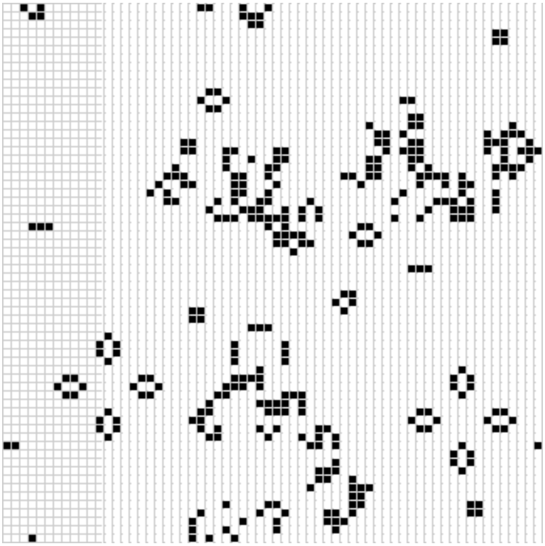

# rust-wasm-tutorial

I study wasm with rust on this site:
https://rustwasm.github.io/docs/book/

# Road Map
- [x] Hello, World!
- [x] Rules
- [x] Implementing Life
- [x] Testing Life
- [x] Debugging
- [ ] Adding Interactivity

# Preview Image

