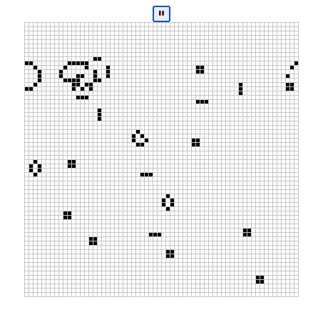

# rust-wasm-tutorial

Studying wasm with rust on this site:
https://rustwasm.github.io/docs/book/

# Road Map
- [x] 4.2. Hello, World!
- [x] 4.3. Rules
- [x] 4.4. Implementing Life
- [x] 4.5. Testing Life
- [x] 4.6. Debugging
- [x] 4.7. Adding Interactivity
- [ ] 4.8. Time Profiling
- [ ] 4.9. Shrinking .wasm Size
- [ ] 4.10. Publishing to npm

now 4.8

# Preview Image

